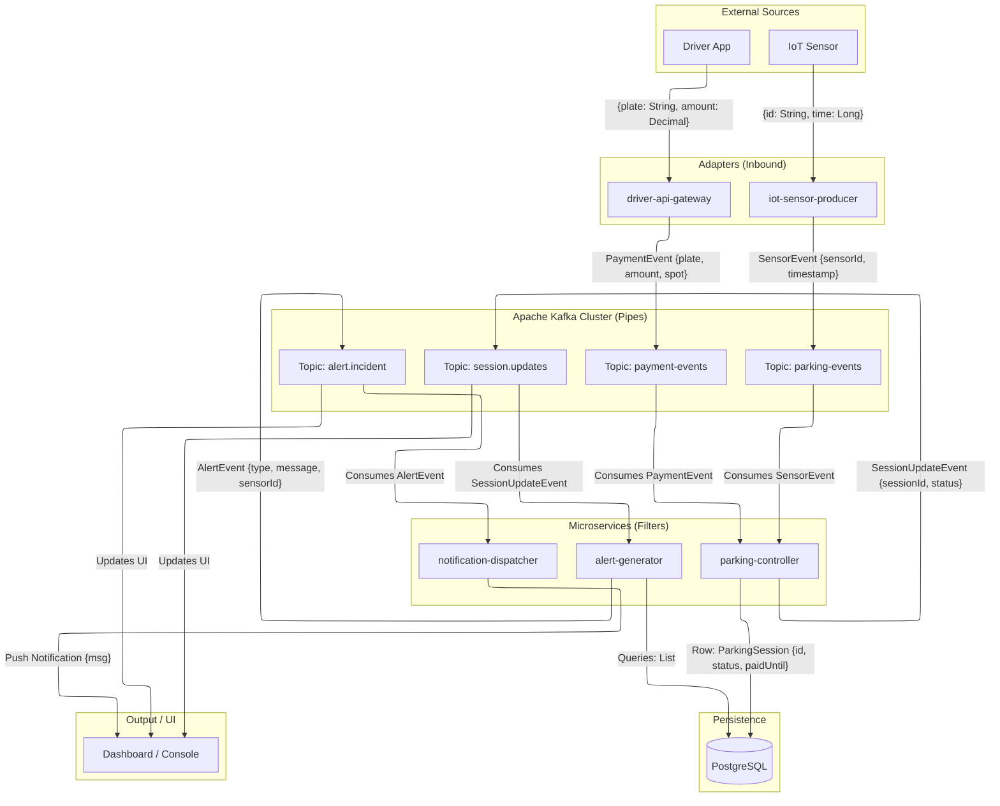
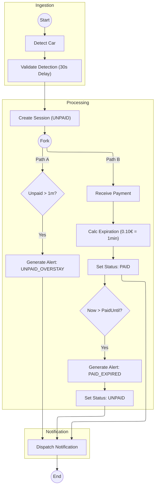

# Sensor Data Validator (Smart Parking System)

## 1. Project Objective
The **Sensor Data Validator** is a distributed Smart Parking System designed to validate real-time sensor data, manage parking sessions, process payments, and generate alerts for rule violations. The system ensures data integrity and provides real-time monitoring capabilities for parking operators.

## 2. Architecture & Design Patterns

The system is built using a **Microservices Architecture** and implements the **Pipes and Filters** architectural style, supported by the **Adapter** design pattern.

### 2.1 Microservices
The system is composed of 5 independent, containerized services:
1.  **iot-sensor-producer**: Simulates IoT parking sensors sending occupancy data.
2.  **driver-api-gateway**: REST API for drivers to make payments.
3.  **parking-controller**: The core logic unit. It creates sessions, processes payments, and filters sensor noise.
4.  **alert-generator**: Monitors sessions for violations (unpaid overstay, expired payment) and generates alerts.
5.  **notification-dispatcher**: Consumes alerts and simulates sending push notifications to operators/users.

### 2.2 Pipes and Filters
The system relies on **Apache Kafka** as the central "Pipe" to transport messages between services ("Filters").
*   **Pipe**: Kafka Topics (`parking-events`, `payment-events`, `session.updates`, `alert.incident`).
*   **Filters**: Each microservice consumes a message, processes (filters/transforms) it, and produces a new message or action.
    *   *Example*: `parking-controller` consumes raw `parking-events`, filters out noise (<30s), and produces valid `ParkingSession` objects.

### 2.3 Adapter Pattern
The Adapter pattern is used to translate external interfaces into the internal event-driven format:
*   **Driver API Gateway**: Adapts external HTTP REST requests (Payment) into internal Kafka `PaymentEvent` messages.
*   **IoT Sensor Producer**: Adapts simulated sensor signals into Kafka `SensorEvent` messages.
*   **Repositories**: Adapt Java Domain Objects (`ParkingSession`) to the Relational Database schema (PostgreSQL).

#### Code Example: Adapter Pattern
The `PaymentController` acts as an adapter, converting an external **HTTP REST Request** into an internal **Kafka Event**.

```java
// Adapter: Converts HTTP POST -> Kafka Message
@RestController
@RequestMapping("/api/payments")
public class PaymentController {

    private final KafkaTemplate<String, String> kafkaTemplate;

    @PostMapping("/pay")
    public ResponseEntity<String> processPayment(
            @RequestParam String plate,
            @RequestParam String parkingSpot,
            @RequestParam BigDecimal amount) {

        // 1. Adapt Input: Create internal Event object from HTTP params
        PaymentEvent event = new PaymentEvent(plate, parkingSpot, amount, System.currentTimeMillis());

        // 2. Publish to Pipe: Send to Kafka
        String jsonMessage = objectMapper.writeValueAsString(event);
        kafkaTemplate.send("payment-events", plate, jsonMessage);

        return ResponseEntity.ok("Payment processed");
    }
}
```
```
```

## 4. System Diagrams

### 4.1 System Architecture (Design)
This diagram illustrates the **Microservices**, **Pipes and Filters** (Kafka), and **Data Persistence** (PostgreSQL) layers.



### 4.2 Activity Flow
This diagram demonstrates the logic flow from sensor detection to alert generation, including the **30s Noise Filter** and **Payment Expiration** rules.



## 5. How to Run & Test Rules

### `demo.sh`
The master script to build and run the entire system.
*   **Usage**: `sudo ./demo.sh`
*   **Actions**:
    1.  Stops existing containers.
    2.  Builds Docker images for all services.
    3.  Starts the infrastructure (Kafka, Zookeeper, Postgres, Prometheus, Grafana).
    4.  Starts the microservices.
    5.  Triggers an initial simulation (Sensor A1).

### `monitor.sh`
A helper script to provide real-time visibility.
*   **Usage**: Automatically called by `demo.sh`, or run via `./monitor.sh`.
*   **Actions**: Opens optimized terminal windows to tail logs for `parking-controller`, `alert-generator`, and `driver-api`.

### Monitoring UIs
*   **Kafka UI**: [http://localhost:8090](http://localhost:8090) - Inspect topics and messages.
*   **Grafana**: [http://localhost:3000](http://localhost:3000) (admin/admin) - Visualize system metrics.

## 4. How to Run & Test Rules

### Prerequisites
*   Docker & Docker Compose
*   Java 21 (for local development)

### Step 1: Start the System
```bash
sudo ./demo.sh
```
Wait for the terminals to open and the "Demo Running!" message.

### Step 2: Test Rules

#### Rule 1: Sensor Noise Filtering (30s Delay)
*   **Logic**: A car must occupy a spot for >30 seconds to create a session.
*   **Test**: The `demo.sh` triggers a sensor event. Watch the `parking-controller` logs.
*   **Expected Output**:
    *   `>>> Sensor A1 active. Waiting 30s to confirm session...`
    *   (After 30s) `>>> Session Created: ...`

#### Rule 2: Unpaid Overstay Alert (> 1 Minute)
*   **Logic**: If a session is `UNPAID` for more than 1 minute, an alert is generated.
*   **Test**: Do nothing after the session is created. Wait 1 minute.
*   **Expected Output** (in `alert-generator` logs):
    *   `>>> UNPAID Alert: Session ...`
    *   Kafka UI: New message in `alert.incident`.

#### Rule 3: Payment Expiration (0.10 EUR = 1 Minute)
*   **Logic**: Payment buys time. If time runs out, an alert is sent and status reverts to `UNPAID`.
*   **Test**:
    1.  Simulate a payment for spot A1:
        ```bash
        curl -X POST "http://localhost:8080/api/payments/pay?plate=AA-00-XX&amount=0.10&parkingSpot=A1"

### Rule 4: Spot IOT sensor simulator
*  **Test**
    1. Run the code to simulate a car in the parking spot. This generates a parking session after 30 seconds.
   ```bash
    curl -X POST "http://localhost:8081/api/simulation/trigger?id=A1&time=600"


   ```
   
    2.  **Expected Output** (`parking-controller`): `>>> Payment Processed... Paid until: <Time + 1 min>`
    3.  Wait > 1 minute.
    4.  **Expected Output** (`alert-generator`):
        *   `>>> EXPIRED Alert: Session ...`
        *   Status updates back to `UNPAID`.
