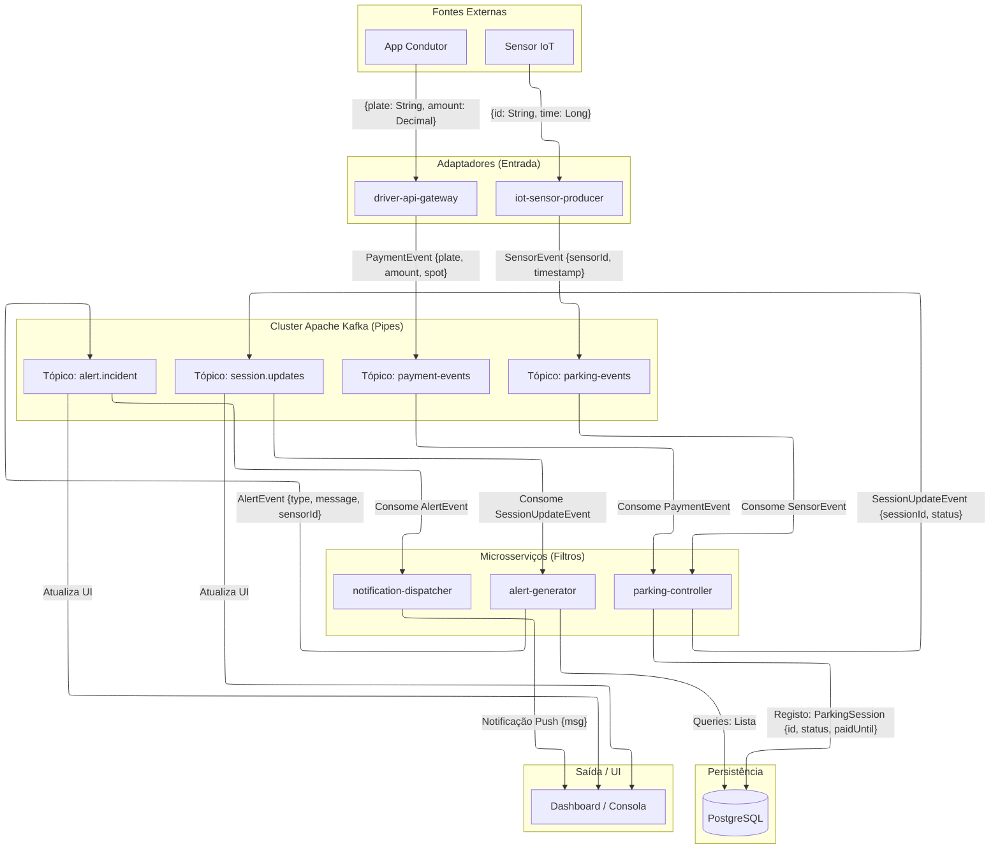
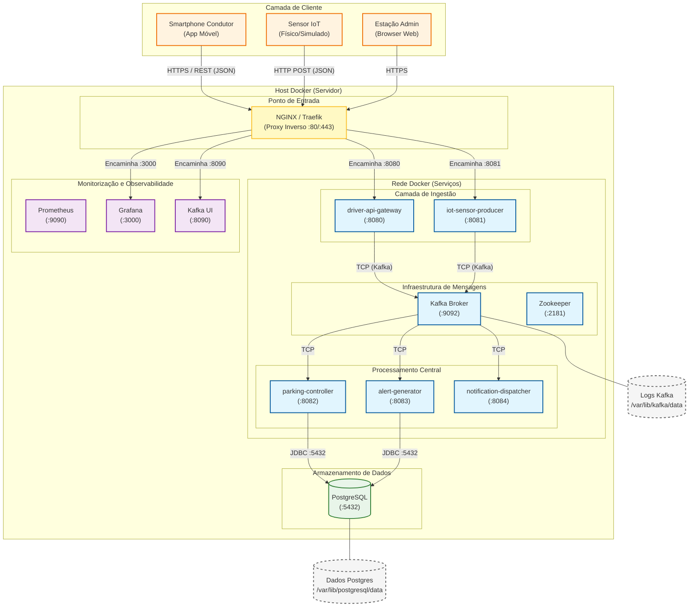
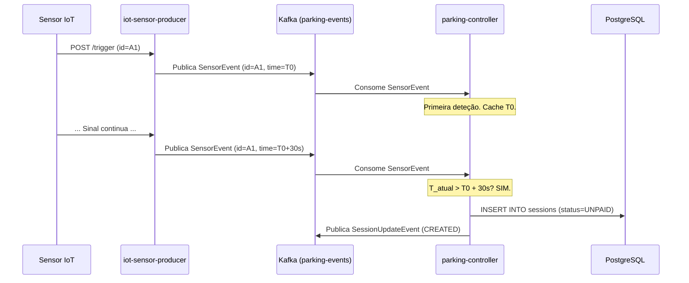
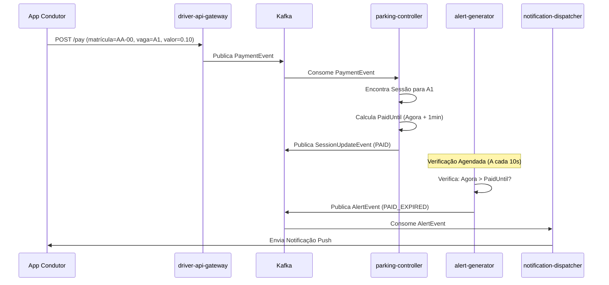

# Sensor Data Validator - Documentação Abrangente do Sistema

**Projeto:** Sistema de Estacionamento Inteligente (Sensor Data Validator)
**Versão:** 1.0.0
**Data:** Dezembro 2025

---

## 1. Introdução

O **Sensor Data Validator** é um Sistema de Estacionamento Inteligente distribuído e orientado a eventos, concebido para gerir sessões de estacionamento em tempo real. O sistema valida dados de sensores para filtrar ruído, processa pagamentos, monitoriza infrações (estadias não pagas, pagamentos expirados) e envia alertas para os operadores.

O sistema é construído sobre uma **Arquitetura de Microsserviços**, utilizando **Apache Kafka** para comunicação assíncrona (padrão *Pipes and Filters*) e **Docker** para implementação em contentores.

### 1.1 Funcionalidades Principais
*   **Validação de Sensores em Tempo Real**: Filtra sinais transitórios (ex: carros a passar) utilizando uma regra de estabilidade de 30 segundos.
*   **Gestão de Sessões**: Cria e termina automaticamente sessões de estacionamento com base na atividade do sensor.
*   **Processamento de Pagamentos**: Aceita pagamentos via API REST e atualiza o estado da sessão.
*   **Deteção de Infrações**:
    *   **Estadia Não Paga**: Alerta se um carro permanecer mais de 1 minuto sem pagamento.
    *   **Pagamento Expirado**: Alerta se uma sessão paga exceder o tempo adquirido.
*   **Envio de Alertas**: Simula notificações *push* para os agentes de fiscalização.

---

## 2. Arquitetura do Sistema

### 2.1 Arquitetura Lógica (Microsserviços e Kafka)
O sistema é composto por cinco microsserviços desacoplados que comunicam exclusivamente através de tópicos Kafka.



### 2.2 Implementação Física (Docker e Redes)
O sistema é implementado num *Host* Docker com uma rede *bridge* personalizada. O **NGINX** atua como ponto de entrada único (*Reverse Proxy*), encaminhando o tráfego externo para os contentores internos apropriados.



---

## 3. Interações Detalhadas (Diagramas de Sequência)

### 3.1 Cenário: Estacionamento e Criação de Sessão
Esta sequência mostra como um sinal de sensor é validado e transformado numa sessão.



### 3.2 Cenário: Pagamento e Expiração
Esta sequência mostra o fluxo de pagamento e o subsequente alerta de expiração.



---

## 4. Padrões de Design e Implementação de Código

### 4.1 Padrão Adapter (Camada de Ingestão)
O padrão *Adapter* é utilizado para converter protocolos externos (HTTP) em eventos de domínio internos (Kafka).

**Componente:** `driver-api-gateway` / `PaymentController.java`
```java
@RestController
@RequestMapping("/api/payments")
public class PaymentController {
    // ...
    @PostMapping("/pay")
    public ResponseEntity<String> processPayment(
            @RequestParam String plate,
            @RequestParam String parkingSpot,
            @RequestParam BigDecimal amount) {

        // ADAPTER: Mapeia Params HTTP -> PaymentEvent
        PaymentEvent event = new PaymentEvent(plate, parkingSpot, amount, System.currentTimeMillis());

        // Publica no Pipe
        String jsonMessage = objectMapper.writeValueAsString(event);
        kafkaTemplate.send(paymentTopic, event.getPlate(), jsonMessage);

        return ResponseEntity.ok("Payment processed");
    }
}
```

### 4.2 Pipes and Filters (Lógica Central)
Cada serviço atua como um filtro no fluxo de dados.

**Componente:** `parking-controller` / `ParkingController.java`
```java
@KafkaListener(topics = "parking-events", groupId = "controller-sensor-group")
public void handleSensorEvent(String message) {
    SensorEvent event = objectMapper.readValue(message, SensorEvent.class);
    
    // LÓGICA DE FILTRO: Redução de Ruído (Atraso de 30s)
    if (!pendingSessions.containsKey(event.getSensorId())) {
        pendingSessions.put(event.getSensorId(), LocalDateTime.now());
        logger.info(">>> Sensor {} active. Waiting 30s...", event.getSensorId());
    } else {
        // ... Verifica se passaram 30s ...
        // ... Cria Sessão ...
    }
}
```

### 4.3 Padrão Observer/Listener (Notificações)
O *dispatcher* escuta eventos e reage.

**Componente:** `notification-dispatcher` / `NotificationDispatcher.java`
```java
@KafkaListener(topics = "alert.incident", groupId = "notification-group")
public void handleAlert(String message) {
    AlertEvent event = objectMapper.readValue(message, AlertEvent.class);
    
    // AÇÃO: Despacha Notificação
    System.out.println(">>> [PUSH NOTIFICATION] " + event.getMessage());
}
```

---

## 5. Modelos de Dados (Common DTOs)

A biblioteca `common-dto` assegura que todos os microsserviços falam a mesma linguagem.

### 5.1 `SensorEvent`
Gerado por `iot-sensor-producer`.
```java
public class SensorEvent {
    private String sensorId;
    private Long timestamp;
    // ... getters/setters
}
```

### 5.2 `PaymentEvent`
Gerado por `driver-api-gateway`.
```java
public class PaymentEvent {
    private String plate;
    private String parkingSpot;
    private BigDecimal amount;
    private Long timestamp;
    // ... getters/setters
}
```

### 5.3 `AlertEvent`
Gerado por `alert-generator`.
```java
public class AlertEvent {
    private String type; // ex: "UNPAID_OVERSTAY", "PAID_EXPIRED"
    private String spot;
    private String message;
    private Long timestamp;
    // ... getters/setters
}
```

---

## 6. Estrutura do Projeto

```
.
├── alert-generator/           # [Serviço] Monitoriza sessões & gera alertas
│   └── src/main/java/.../AlertGenerator.java  # Lógica Central de Alertas
├── common-dto/                # [Biblioteca] Modelos de Dados Partilhados (Eventos)
├── driver-api-gateway/        # [Serviço] API REST para Pagamentos
│   └── src/main/java/.../PaymentController.java # Lógica do Adaptador
├── iot-sensor-producer/       # [Serviço] Simula Sensores IoT
│   └── src/main/java/.../SimulationController.java # Lógica de Simulação
├── notification-dispatcher/   # [Serviço] Envia Notificações Push
├── parking-controller/        # [Serviço] Lógica de Negócio Central (Gestão de Sessões)
├── grafana/                   # [Config] Dashboards
├── docker-compose.yml         # [Implementação] Orquestração de Contentores
├── demo.sh                    # [Script] Construir & Executar
└── pom.xml                    # [Build] Maven Parent
```

---

## 7. Stack Tecnológico & Versões

| Componente | Tecnologia | Versão | Propósito |
| :--- | :--- | :--- | :--- |
| **Linguagem** | Java | 21 | Desenvolvimento central |
| **Framework** | Spring Boot | 3.4.0 | Framework de microsserviços |
| **Mensagens** | Apache Kafka | 7.5.0 (Confluent) | Streaming de eventos |
| **Base de Dados** | PostgreSQL | 15-alpine | Armazenamento persistente |
| **Contentor** | Docker | Latest | Ambiente de execução |
| **Orquestração** | Docker Compose | 3.8 | Implementação local |
| **Monitorização** | Prometheus | Latest | Recolha de métricas |
| **Visualização** | Grafana | Latest | Dashboard de métricas |
